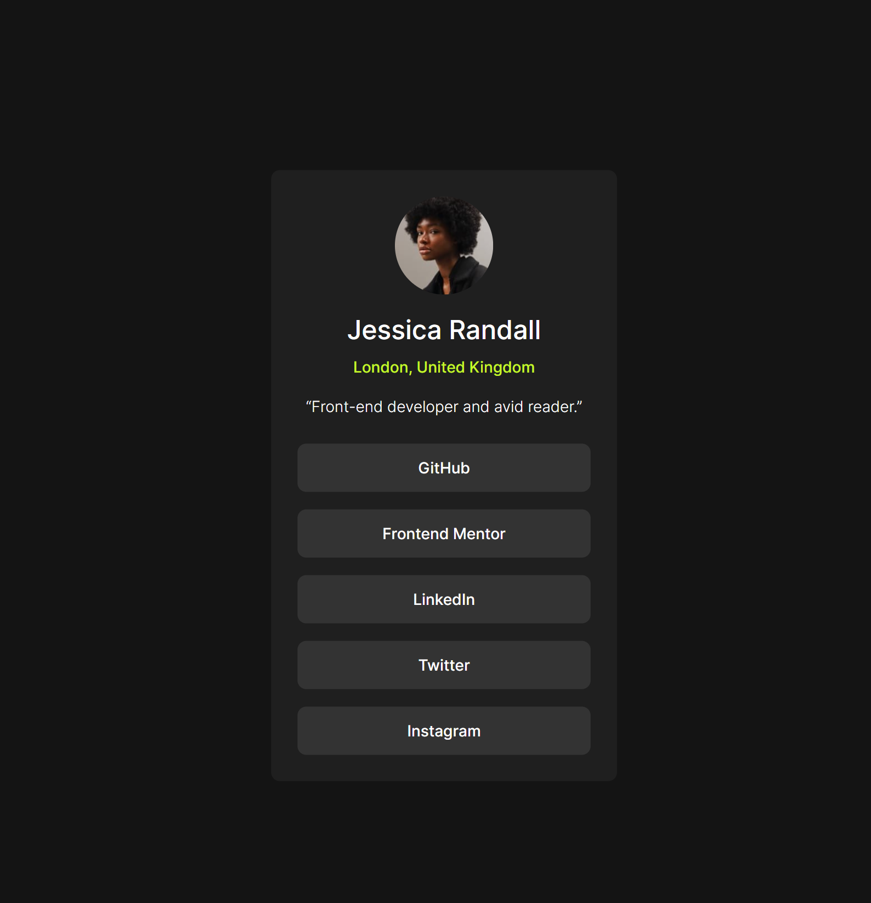

# Hello!

I havent coded frontend in a while and wanted to refresh my memory so I'm going to be doing frontend mentor challenges starting from the easiest projects to code and working my way up to more complex frontend projects

### I built this project using:

- React with Vite

### Here's screenshots of the project:

